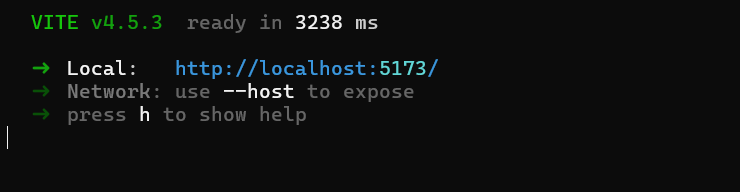
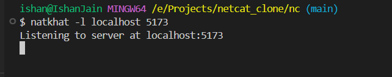

# Natkhat - an netcat clone

An attempt to clone netcat's functionalities using nodejs's native abilities, and not using external libraries, so as to understand how things work under the hood
## Screenshots


<br>



### How to setup on your machine
* Clone the repo on your machine
```
    git clone https://github.com/ishanjain1502/natkhat.git
```

* To gloablly install the utility
```
    npm install -g .
```

* Reach out the directory of the project and run directly from here without installing it globally
```
    <The commad you want to fire>
```


### Some Basic features currently present in this build are

* Listening to a TCP server
    ```
    natkhat -l <IP> <PORT>
    ```
* Listening to a list of TCP servers
    ```
    natkhat -l <IP> <PORT1,PORT2,PORT3, ...>
    ```
* Listening to a UDP server
    ```
    natkhat -l <IP> -u <PORT> 
    ```
* Sending Data over connected a UDP server
    ```
    natkhat -l <IP> -u <PORT> <MESSAGE>
    ```
<br>
<tr>  There are lot more fatures that can be built, like using this natkhat as a reverse shell and for utlitising it for hex dump and its analysis, will continue to work on it as whenever possible
<br><br><br>
### Why i named it natkhat?
It's a hindi(my native language) word, which rhymes close to netcatmy, also my idea was netcat was mostly used for mischevious stuff